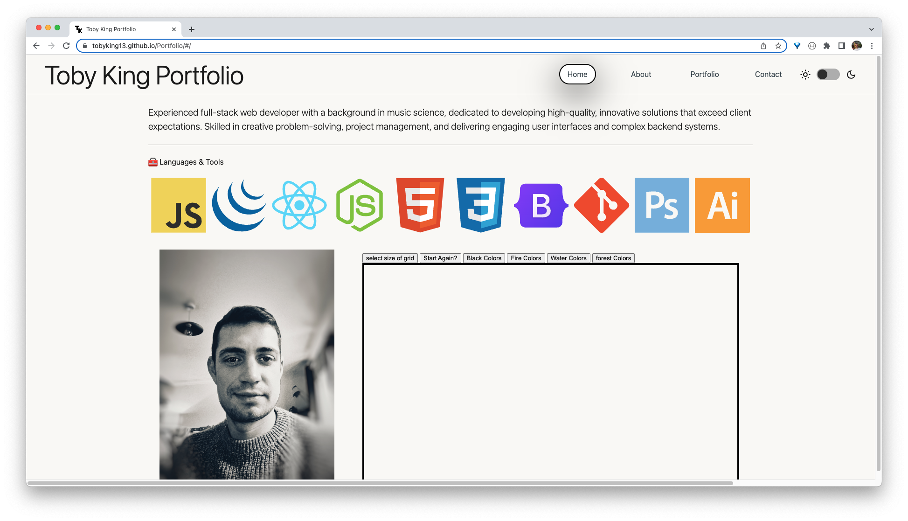

  # Portfolio React App

          

   

  

  ## Description 

  I created a portfolio website using React and installed additional packages such as Bootstrap, Fontawesome, gh-pages, styled components, react router & babel to achieve my desired functionality. The development process was relatively straightforward. Using react router, I constructed each page and added components within them. To dynamically change the header title on each page, I used the useLocation hook to retrieve the URL information and a switch statement to format it accordingly. I encountered some issues with React's component hierarchy, but I was able to resolve them. Finally, I deployed the project to GitHub Pages using the gh-pages package, which facilitates the deployment of React applications to GitHub Pages.

  ## Table of Contents

  - [Installation](#installation)
  - [Screenshot](#screenshot)
  - [Usage](#usage)
  - [Licence](#licence)
  - [Contributing](#contributing)
  - [Tests](#tests)
  - [Questions](#questions)

  ### Installation 

  https://tobyking13.github.io/Portfolio/

  ### Screenshot

  </img>

  ### Usage

  N/A

  ### Licence

  This project is licensed under the MIT license.

  ### Contributing

  * https://github.com/Tobyking13  
  * https://www.youtube.com/watch?v=zgd-z3R1o2k

  ### Tests

  N/A

  ### Questions

  If you have any questions about this application pleas email: tobyking13@gmail.com and I will get back to you as soon as possible. 
  
  You can find more of my work over on GitHub: https://github.com/Tobyking13.
  